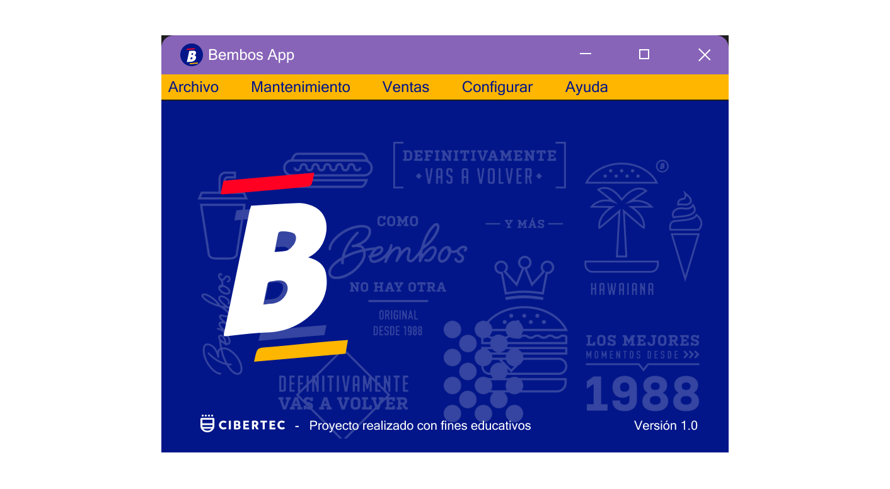
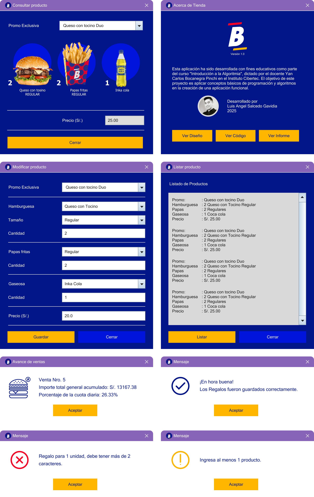

# cibertec1-iaa-project

### Bembos App

Esta aplicación ha sido desarrollada con fines educativos como parte del curso **"Introducción a la Algoritmia"**, en el **Instituto Cibertec**.

El objetivo principal del proyecto es aplicar los conceptos básicos de programación, estructuras de control y diseño de algoritmos para el desarrollo de una aplicación funcional orientada al usuario final. La interfaz gráfica ha sido implementada utilizando **Java Swing**, con el propósito de reforzar el aprendizaje de la programación orientada a objetos y la creación de interfaces amigables.

🔗 [Ver diseño en Figma](https://www.figma.com/design/og3bf3oQxkjahuaH1yghme/cibertec1-iaa-project?node-id=0-1&t=blY39s0cGgXsPXm7-1)



---

## Requisitos

Para ejecutar este proyecto, necesitas tener instalado:

- [JDK 8 o superior](https://www.oracle.com/java/technologies/javase-jdk11-downloads.html)
- Un IDE compatible con proyectos Java (por ejemplo: **NetBeans**, **Eclipse**, **IntelliJ IDEA**)
- Git (opcional, para clonar el repositorio)

---

## Clonar el Repositorio

Puedes clonar este proyecto usando Git desde la terminal o línea de comandos:

```bash
git clone https://github.com/luisangelsalcedo/cibertec1-iaa-project.git
```

---

A continuación, se muestran algunas vistas previas de la aplicación:


